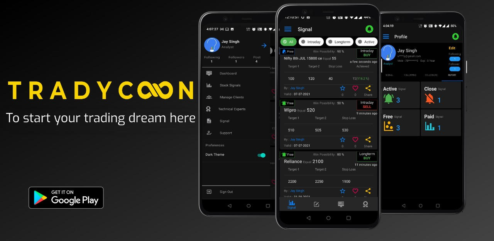

# Tradycoon
A platform to bring together Traders and Analysts in an organized way to make stock trading more efficient.

  

## About
The application serves as a platform for Trading wherein Analysts are able to connect with Traders and manage their businessess in real time. 
It provdes the analysts with better user management features where they can manage their user subscriptions with much ease. 
It also provides analysts a detailed profile of their work which can be used for marketting.
It allows traders to see all the signals they have subscribed to in a single place as well as provides them with micro level info of various analysts available on the platform whom they can contact to take up subscriptions.

The application was deployed on playstore previously and had crossed 2k active users which included both Traders and Analysts.

## Technology
The application was built on React Native while the server was built on NodeJs and ExpressJs. The database used was MongoDB.

The application code in React Native utilizes a flux architecture and involves Redux Thunk, Firebase and related technologies for making the code scalable and easier to handle. 

## Features :
- Login via phone number or Gmail or Facebook: A working authentication system using JWT
- User data provided with privacy settings to manage visibility of the same provided to others using the application: A strict privacy system
- Real-time notifications upon creation of any signal that is available to the Trader: Built using Firebase
- Trader Group Management System for Analysts: Analysts can group Traders based on the subscriptions and assign a date until which the specific Trader can be a part of the group. Signals can be posted to be visible to specific groups
- Automated removal of Traders from groups upon expiring of validity: Once a Trader subscription ends, he is removed from the group
- Global Chat: A global level chat for Analysts to advertise and Traders to discuss. Separately we also have 1 to 1 chat between Traders and Analysts
View profiles of users and follow them along with available contact details
Leaderboard and Report pages for Analysts that can be used by them for marketing their service
